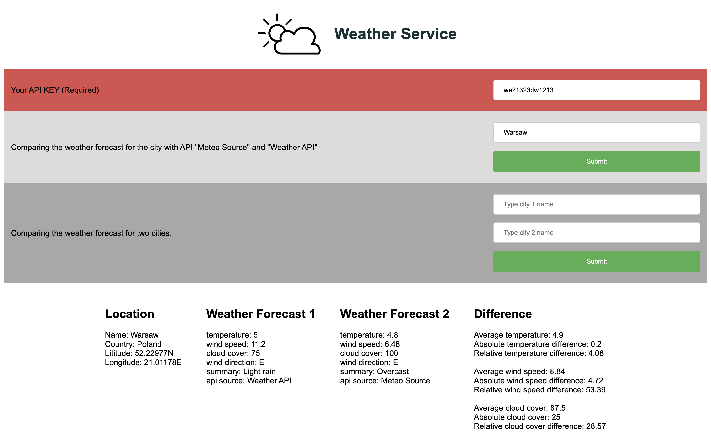

# Weather REST API

## Description

An api for comparing weather statistics using an external API: 

[Meteosource](https://www.meteosource.com/)

[weatherapi](https://www.weatherapi.com/)



## SETUP
```
cd Rest-application
./gradlew build
```

## Running
```
cd Rest-application
 ./gradlew bootRun
```

Run http://localhost:8080/ in your Web Browser.

NOTE: You need to enter the keys to the external api here: Rest-application/src/main/resources/api.properties