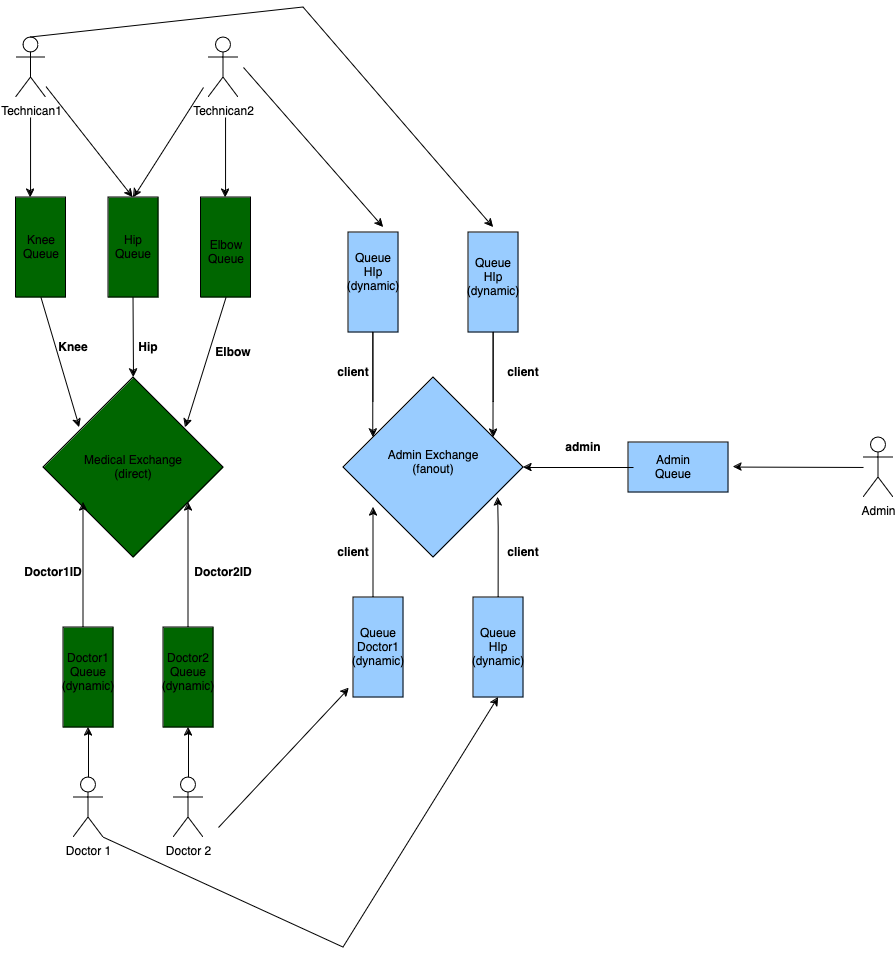

# MOM / RabbitMQ

## Description
We operate the orthopedic department at the hospital

We have 3 types of users:

- Doctor (orders tests, gets results)
- Technician (performs tests, sends results)
- Administrator (logs all activity, can send information to everyone)

The hospital accepts patients with injuries: hip , knee or elbow.

Doctor:
Sends a test order giving the type of test (e.g., knee) and the patient's name, to any technician who knows how to perform such a test
Receives the results asynchronously

Technician
Each technician knows how to perform 2 types of tests, which are given at the start (e.g., knee, hip)
Accepts reports of the type and refers to the ordering physician (result is patient name + type of test + “done”)
Note: if there are two technicians with the same type of examination (e.g., knee) then the message should be handled by only one (but not always the same one)

Administrator
Logs all activity (gets copies of all messages - orders and responses)
Has the ability to send a message (info) to everyone

## How to compile?
```
mvn compile
```

## How to run Administrator?
```
mvn exec:java -Dexec.mainClass="org.example.Administrator"
```

## How to run Doctor?
```
mvn exec:java -Dexec.mainClass="org.example.Doctor"
```


## How to run Technician?
```
mvn exec:java -Dexec.mainClass="org.example.Technician"  -Dexec.args="[Hip|Knee|Elbow] [Hip|Knee|Elbow]"
```

## RabbitMQ Schema
